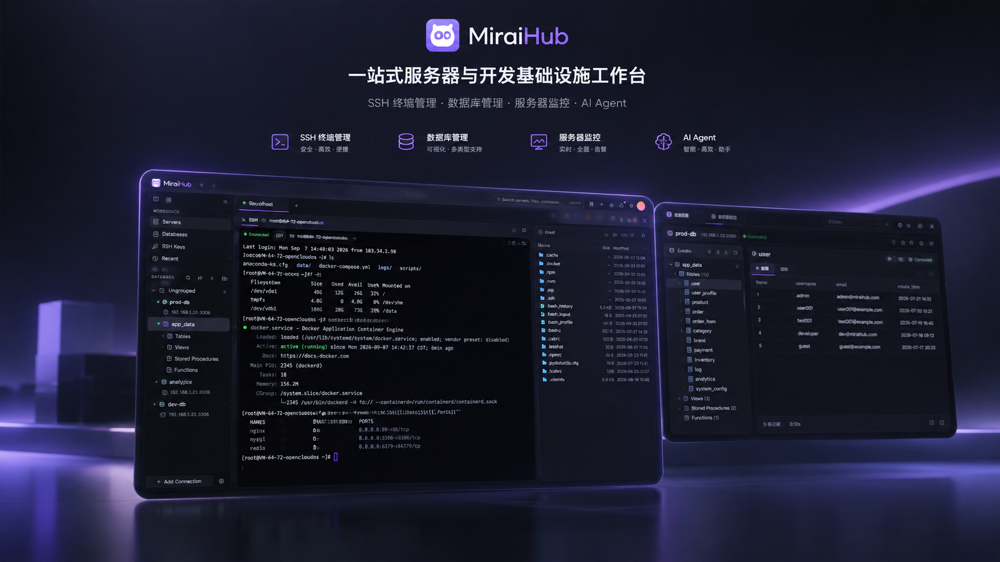
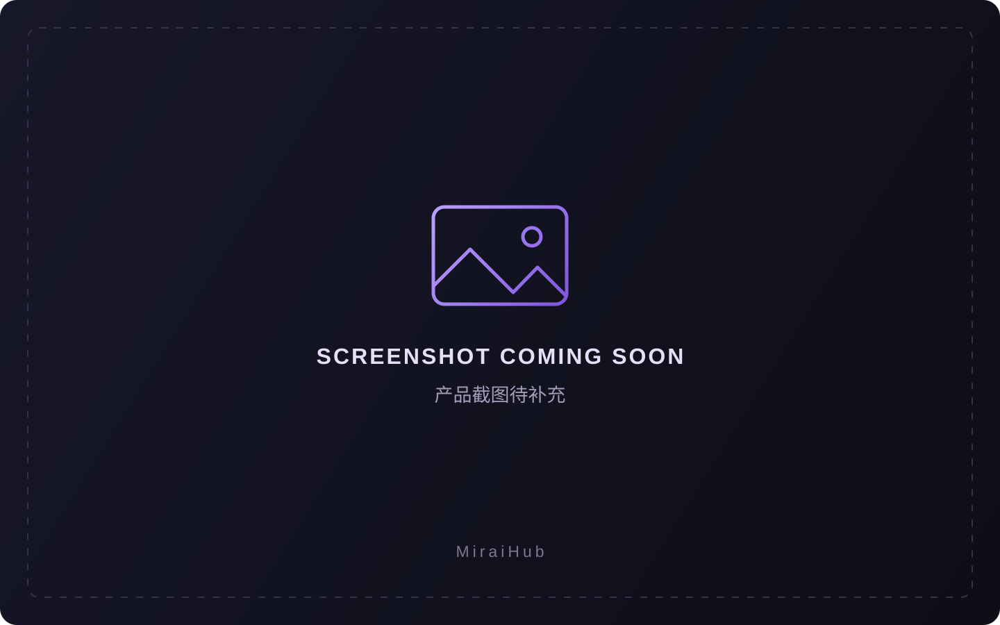

<div align="center">
  
  <h1>MiraiHub</h1>
  <p><strong>A unified workspace for servers and development infrastructure</strong></p>
  <p>SSH terminals · Remote files · Databases · Server monitoring · AI Agent</p>
  <p><a href="README.md">简体中文</a> · <strong>English</strong></p>
  <p>
    <a href="https://github.com/XiangZi7/MiraiHub/releases"></a>
    <a href="https://github.com/XiangZi7/MiraiHub/actions/workflows/release.yml"></a>
    
    
    
  </p>
  <p>
    <a href="https://github.com/XiangZi7/MiraiHub/releases">Download</a> ·
    <a href="#quick-start">Quick start</a> ·
    <a href="#documentation">Documentation</a> ·
    <a href="https://github.com/XiangZi7/MiraiHub/issues">Report an issue</a>
  </p>
</div>



MiraiHub is a desktop workspace built with **Tauri 2, Rust, Vue 3, and TypeScript**. It brings server connections, file transfers, database operations, and AI assistance into one application for developers and server administrators.

Connect to servers, inspect their status, edit remote files, and run SQL in a tabbed workspace. Open the AI Agent panel for the current connection whenever you need assistance.

## Contents

- [Features](#features)
- [Screenshots](#screenshots)
- [Download and installation](#download-and-installation)
- [Quick start](#quick-start)
- [Data and AI](#data-and-ai)
- [Local development](#local-development)
- [Project structure](#project-structure)
- [Documentation](#documentation)
- [Contributing](#contributing)
- [License](#license)

## Features

| Feature | Description |
| --- | --- |
| **SSH and local terminals** | Multiple connection tabs, SSH password and key authentication, split terminals, terminal search, saved commands, and startup command presets. |
| **Remote file management** | Browse, upload, and download files over SFTP; track transfers in one place. Edit remote text files with save previews and conflict detection. |
| **Database workspace** | MySQL / PostgreSQL support with an object tree, table browsing and editing, a table designer, a SQL editor, query history, and SQL import/export. |
| **Server monitoring** | Collect CPU, memory, disk, network throughput, and uptime metrics from Linux servers over SSH, without installing a monitoring agent. |
| **AI Agent** | Chat within SSH and database workspaces, with model profiles, text attachments, tool calling, and history. Choose per-action approval, automatic read-only tools, or full access in the composer. |
| **Server operations** | SSH local port forwarding, batch commands, SSH key management, connection groups and tags, and connection backup/restore. |
| **Personalization** | Simplified Chinese / English, system language detection, theme skins, custom colors and backgrounds, UI scaling, and resizable split views. |

## Screenshots

<!-- Maintainers: all four slots currently share a placeholder. See docs/images/README.md for replacement paths and instructions. -->
<table>
  <tr>
    <td width="50%" align="center">
      <strong>SSH terminals and remote files</strong><br /><br />
      <!-- Replace src with docs/images/ssh-workspace.png -->
      <br />
      <sub>Terminal sessions, file browsing, and transfers</sub>
    </td>
    <td width="50%" align="center">
      <strong>Database workspace</strong><br /><br />
      <!-- Replace src with docs/images/database-workspace.png -->
      <br />
      <sub>Database objects, data editing, and SQL queries</sub>
    </td>
  </tr>
  <tr>
    <td width="50%" align="center">
      <strong>Server monitoring</strong><br /><br />
      <!-- Replace src with docs/images/server-monitoring.png -->
      <br />
      <sub>CPU, memory, disk, and network status</sub>
    </td>
    <td width="50%" align="center">
      <strong>AI Agent</strong><br /><br />
      <!-- Replace src with docs/images/ai-agent.png -->
      <br />
      <sub>Contextual chat, action confirmation, and history</sub>
    </td>
  </tr>
</table>

## Download and installation

Visit [GitHub Releases](https://github.com/XiangZi7/MiraiHub/releases) and choose the assets for your preferred version.

| Platform | Current release coverage |
| --- | --- |
| Windows x64 | The release workflow produces an installer and a portable ZIP. |
| macOS / Linux | The current release workflow does not produce builds for these platforms. |

| Asset | Purpose |
| --- | --- |
| `MiraiHub_<version>_windows_x64_setup.exe` | Windows installer; follow the setup wizard. |
| `MiraiHub_<version>_windows_x64_portable.zip` | Extract the archive and run `miraihub.exe`. |
| `SHA256SUMS.txt` | SHA-256 checksums for verifying downloaded files. |
| `version.json` | Version, tag, source commit, and platform metadata. |

The portable build requires **WebView2 Runtime** to be installed. User data remains in the application data directory, separate from the extracted ZIP. Code signing is not configured in the current release workflow, so Windows may display an “Unknown publisher” message. See the [release guide](docs/RELEASING.md) for details.

## Quick start

1. **Add a connection**: Create an SSH, local terminal, or database connection from the sidebar. Enter its address, port, and credentials, and organize environments with groups and tags.
2. **Open a workspace**: Use the terminal, file panel, and server overview after connecting over SSH. For databases, browse objects, edit data, or run SQL.
3. **Configure AI (optional)**: Open **Settings → AI Agent**, add a service URL, API format, model ID, and API key, then save and test the connection.
4. **Work with the agent**: Open the AI Agent tab or split view in an SSH or database workspace. Review the target and full command or SQL before confirming an action proposed by the agent.

AI features require your own model service with tool calling support. The app includes OpenAI, Claude, DeepSeek, Doubao, Gemini, and custom endpoint presets, using either the **OpenAI Chat Completions compatible format** or the **Claude Messages format**. The Gemini preset uses its OpenAI compatible endpoint. See the [AI Agent guide](docs/ai-agent.md) for configuration and protocol coverage.

## Data and AI

- **Model requests**: Conversations and tool results are sent to the model service you configure. Viewing local conversation history does not itself send a model request.
- **Local storage**: On Windows, AI settings and conversation history are encrypted with DPAPI for the current OS user. Regular connection settings use local WebView storage; connection passwords and key passphrases you choose to save are currently stored with those settings.
- **Connection backups**: Credentials are excluded by default. Including them requires a separate backup password. Backup encryption is independent of local connection storage.

See [AI Agent](docs/ai-agent.md) and [SSH operations and connection backups](docs/ssh-operations.md) for details.

## Local development

### Prerequisites

These versions match the repository's current Windows release workflow:

| Dependency | Version / requirement |
| --- | --- |
| Node.js | `22.22.2` |
| pnpm | `10.33.0`, specified by `packageManager` in `package.json` |
| Rust | `1.96.0`, including Cargo |
| Windows native build tools | Visual Studio C++ Build Tools and the Windows SDK |
| WebView | WebView2 Runtime |

### Clone and run

```powershell
git clone https://github.com/XiangZi7/MiraiHub.git
cd MiraiHub
pnpm install --frozen-lockfile
pnpm tauri dev
```

`pnpm tauri dev` starts both the frontend development server and the desktop application. Use `pnpm dev` for a frontend preview only; native features such as SSH and database access require the Tauri application.

### Checks and builds

```powershell
# Frontend utility and release logic tests
pnpm test

# Rust backend tests
cargo test --locked --manifest-path src-tauri/Cargo.toml --lib

# Vue / TypeScript checks and frontend production build
pnpm build

# Application version consistency check
pnpm version:check

# Build the Windows NSIS installer
pnpm release:build
```

### Releasing

After committing the code to be released, maintainers can preview the version change and then publish:

```powershell
pnpm release --dry-run
pnpm release
```

`pnpm release` increments the patch version by default; `pnpm release minor` and `pnpm release major` are also available. The release command requires a clean working tree and push access to `origin`. It synchronizes version files, creates a commit, and pushes the current branch and a new tag to trigger GitHub Actions testing, packaging, and publishing.

See the [release guide](docs/RELEASING.md) for first-time setup, prerelease tags, retries, and local asset packaging.

## Project structure

```text
MiraiHub/
├── src/                  # Vue + TypeScript frontend
│   ├── api/              # Tauri IPC and persistence interfaces
│   ├── components/       # Workspace and shared UI components
│   ├── composables/      # Session and interaction logic
│   ├── i18n/             # Chinese and English translations
│   ├── layouts/          # Workspace layouts
│   ├── pages/            # Workspace and separate window pages
│   ├── router/           # Routes and window entry points
│   └── stores/           # Pinia state management
├── src-tauri/            # Tauri + Rust desktop backend
│   └── src/              # SSH, SFTP, databases, AI, and platform integration
├── public/               # Static application assets
├── docs/                 # Feature, architecture, and release documentation
│   └── images/           # README product images and screenshot placeholders
├── scripts/              # Version management and packaging scripts
├── tests/                # Automated tests and UI verification fixtures
└── .github/workflows/    # GitHub Actions release workflow
```

## Documentation

The detailed guides below are currently in Simplified Chinese. The screenshot maintenance guide is bilingual.

| Guide | Topics |
| --- | --- |
| [AI Agent](docs/ai-agent.md) | Model configuration, conversation history, action confirmation, and data handling. |
| [SSH operations](docs/ssh-operations.md) | Port forwarding, remote editing, batch commands, and connection backups. |
| [Theme skins](docs/theme-skins.md) | Themes, custom backgrounds, colors, and split layouts. |
| [Interface languages](docs/languages.md) | Chinese / English switching and system language detection. |
| [Frontend architecture](docs/FRONTEND_ARCHITECTURE.md) | Directory responsibilities, routing, session caching, and store conventions. |
| [Performance](docs/PERFORMANCE.md) | Performance implementation notes and verification records. |
| [Releasing](docs/RELEASING.md) | Automated releases, version management, and local packaging. |
| [Screenshot maintenance](docs/images/README.md) | Image filenames and instructions for replacing screenshot placeholders. |

## Contributing

Use [Issues](https://github.com/XiangZi7/MiraiHub/issues) to report bugs or suggest features, or open a pull request to improve code, documentation, and translations.

- **Report a bug**: Include the app version, operating system, reproduction steps, expected behavior, and actual result. Remove passwords, private keys, API keys, and other sensitive information from screenshots and logs.
- **Submit a change**: Fork the repository and create a branch. Keep each PR focused on one issue, explain the change and how it was verified, and update related documentation when behavior changes.
- **Verify your work**: For code changes, run the relevant tests and build commands above. For documentation changes, check links, command examples, and consistency between the Chinese and English READMEs.

## License

A `LICENSE` file has not been added yet. The project license is pending confirmation by the maintainer.
