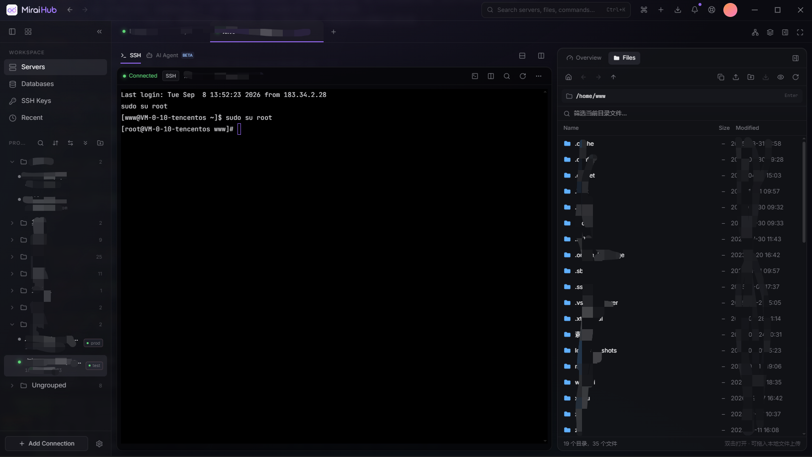
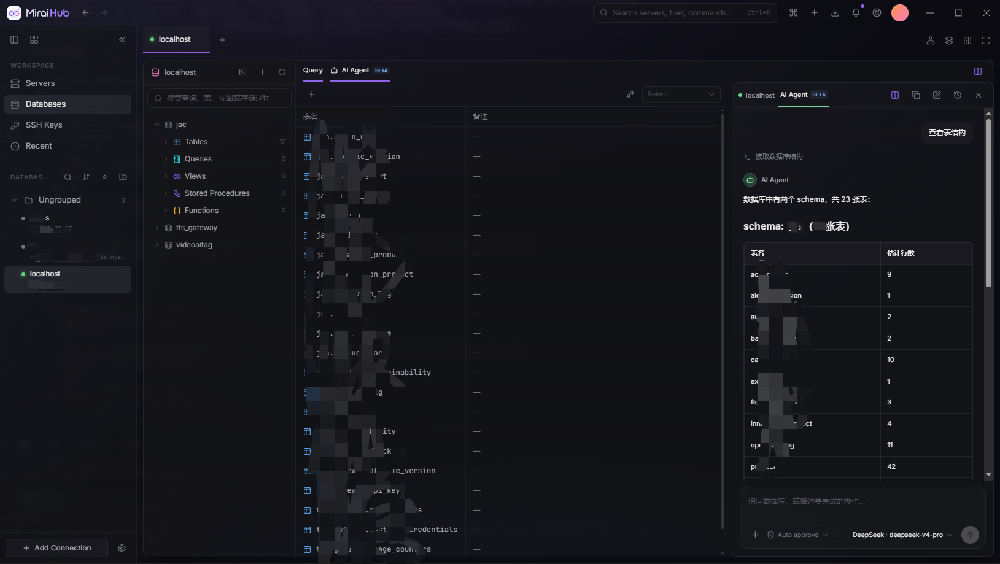
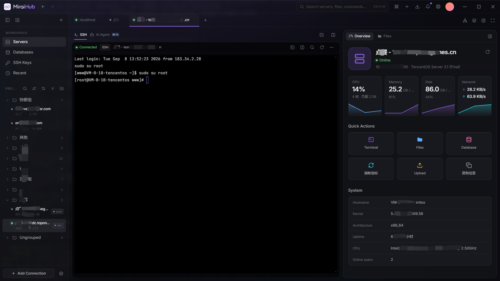

<div align="center">
  
  <h1>MiraiHub</h1>
  <p><strong>A unified workspace for servers and development infrastructure</strong></p>
  <p>SSH terminals · Remote files · Databases · Server monitoring · AI Agent</p>
  <p>
    <a href="https://github.com/XiangZi7/MiraiHub/releases"></a>
    <a href="https://github.com/XiangZi7/MiraiHub/releases"></a>
    <a href="https://github.com/XiangZi7/MiraiHub/actions/workflows/release.yml"></a>
    
    
    
  </p>
  <p>
    <a href="https://github.com/XiangZi7/MiraiHub/releases/latest"><strong>Download</strong></a> ·
    <a href="#quick-start">Quick start</a> ·
    <a href="#documentation">Docs</a> ·
    <a href="https://github.com/XiangZi7/MiraiHub/issues">Report an issue</a> ·
    <a href="README.md">简体中文</a>
  </p>
</div>

<br />


MiraiHub is a desktop workspace built with **Tauri 2 + Rust + Vue 3**. It brings server connections, file transfers, database operations, monitoring, and AI assistance into a single tabbed window for developers and server administrators.

## Features

| | Feature | Description |
| :-: | --- | --- |
| 🖥️ | **SSH & local terminals** | Multiple connection tabs, password / key auth, split terminals, terminal search, saved commands, and startup presets |
| 📁 | **Remote files** | Browse, drag-and-drop upload, and download over SFTP with a unified transfer center; edit remote text files with save previews and conflict checks |
| 🗄️ | **Database workspace** | MySQL / PostgreSQL; object tree, data browsing and editing, table designer, SQL editor, query history, import / export |
| 📈 | **Server monitoring** | CPU, memory, disk, network, and uptime collected over SSH, no agent to install on the server |
| 🤖 | **AI Agent** | Chat inside SSH and database workspaces with model profiles, attachments, tool calling, and history; choose per-action approval, auto read-only, or full access |
| 🛠️ | **Server operations** | Local port forwarding, batch commands, SSH key management, connection groups and tags, encrypted backup and restore |
| 🎨 | **Personalization** | Chinese / English with system detection, theme skins, custom colors and backgrounds, UI scaling, resizable split views |

## Screenshots

<table>
  <tr>
    <td width="50%" align="center">
      <br />
      <sub><b>SSH terminal and remote files</b></sub>
    </td>
    <td width="50%" align="center">
      <br />
      <sub><b>Database workspace with AI Agent</b></sub>
    </td>
  </tr>
  <tr>
    <td width="50%" align="center">
      <br />
      <sub><b>Server monitoring</b></sub>
    </td>
    <td width="50%" align="center">
      <br />
      <sub><b>Theme skins and custom backgrounds</b></sub>
    </td>
  </tr>
</table>

## Download & install

Grab the latest build from [Releases](https://github.com/XiangZi7/MiraiHub/releases/latest). Only **Windows x64** is published today; macOS / Linux builds are not available yet.

| File | Notes |
| --- | --- |
| `MiraiHub_<version>_windows_x64_setup.exe` | Installer, follow the wizard |
| `MiraiHub_<version>_windows_x64_portable.zip` | Portable build, extract and run `miraihub.exe`; requires [WebView2 Runtime](https://developer.microsoft.com/microsoft-edge/webview2/) |
| `SHA256SUMS.txt` / `version.json` | Checksums plus version and source commit metadata |

> Builds are not code-signed yet, so Windows SmartScreen may show an "Unknown publisher" warning; choose "Run anyway". User data lives in the system app-data directory and does not move with the portable ZIP.

## Quick start

1. **Add a connection**: Create an SSH, local terminal, or database connection from the sidebar. Enter the address, port, and credentials; organize with groups and tags.
2. **Open a workspace**: After connecting over SSH, use the terminal, file panel, and server overview. For databases, browse objects, edit data, or run SQL.
3. **Configure AI (optional)**: In **Settings → AI Agent**, add a service URL, API format, model ID, and API key, then save and test.
4. **Work with the agent**: Open the AI Agent tab or split view in a workspace. Review any proposed command or SQL before confirming.

AI features require your own model service with tool-calling support. Presets for OpenAI, Claude, DeepSeek, Doubao, Gemini, and custom endpoints are included, using the **OpenAI Chat Completions compatible** or **Claude Messages** format. See the [AI Agent guide](docs/ai-agent.md).

## Privacy & security

- **Model requests**: Conversations and tool results are only sent to the model service you configure.
- **Local storage**: On Windows, AI settings and chat history are encrypted with DPAPI for the current user. Connection settings, plus any passwords or key passphrases you choose to save, live in local WebView storage.
- **Connection backups**: Credentials are excluded by default; including them requires a separate backup password.

## Development

| Dependency | Version |
| --- | --- |
| Node.js | 22.22.2 |
| pnpm | 10.33.0 (pinned by `packageManager`) |
| Rust | 1.96.0 |
| Windows | Visual Studio C++ Build Tools, Windows SDK, WebView2 Runtime |

```powershell
git clone https://github.com/XiangZi7/MiraiHub.git
cd MiraiHub
pnpm install --frozen-lockfile
pnpm tauri dev          # start the frontend and the desktop app
```

```powershell
pnpm test                                                        # frontend and release-logic tests
cargo test --locked --manifest-path src-tauri/Cargo.toml --lib   # Rust backend tests
pnpm build                                                       # type check and frontend build
pnpm release:build                                               # build the Windows installer
pnpm release [patch|minor|major] [--dry-run]                     # release: bump version, tag, and push
```

`pnpm dev` alone previews the frontend; native features such as SSH and databases need the Tauri app. See the [release guide](docs/RELEASING.md) for details.

## Documentation

The guides below are written in Simplified Chinese unless noted.

| Guide | Topics |
| --- | --- |
| [AI Agent](docs/ai-agent.md) | Model configuration, chat history, action confirmation, data handling |
| [SSH operations](docs/ssh-operations.md) | Port forwarding, remote editing, batch commands, connection backups |
| [Theme skins](docs/theme-skins.md) | Themes, custom backgrounds, colors, split layouts |
| [Interface languages](docs/languages.md) | Chinese / English switching and system language detection |
| [Frontend architecture](docs/FRONTEND_ARCHITECTURE.md) | Directory responsibilities, routing, session caching, store conventions |
| [Performance](docs/PERFORMANCE.md) | Performance notes and verification records |
| [Releasing](docs/RELEASING.md) | Automated releases, version management, local packaging |
| [Screenshot maintenance](docs/images/README.md) | README image naming and replacement (bilingual) |

## Contributing

Use [Issues](https://github.com/XiangZi7/MiraiHub/issues) for bugs and feature requests, and pull requests for code, docs, or translation improvements.

- **Report a bug**: Include the app version, OS version, reproduction steps, and expected result. Strip passwords, private keys, and API keys from screenshots and logs.
- **Submit a change**: Keep each PR focused on one issue and describe how it was verified. Update docs and both language READMEs when behavior changes.

## License

A `LICENSE` file has not been added yet; the license is pending confirmation by the maintainer.

<div align="center">
  <sub>Made with ❤️ by <a href="https://github.com/XiangZi7">XiangZi</a></sub>
</div>
