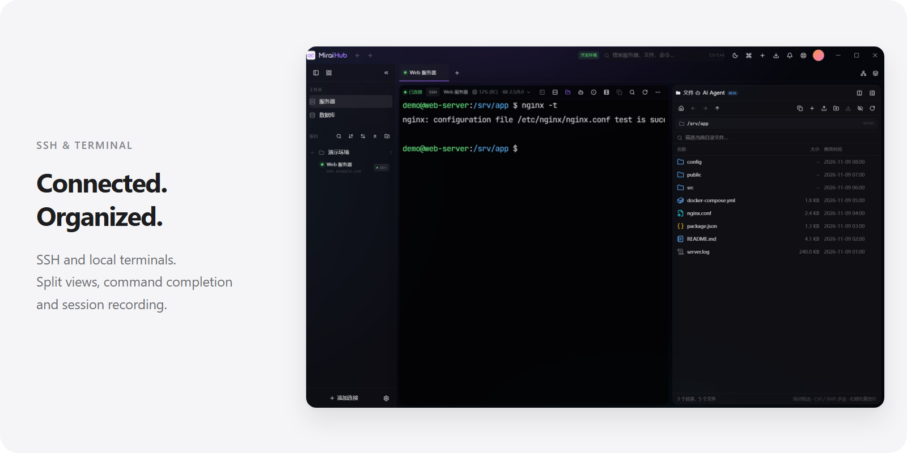
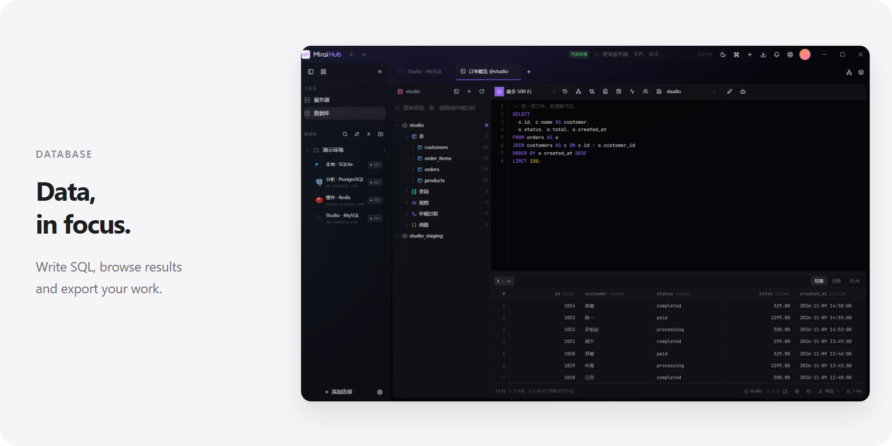
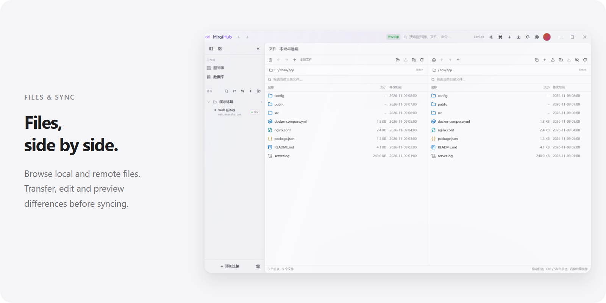
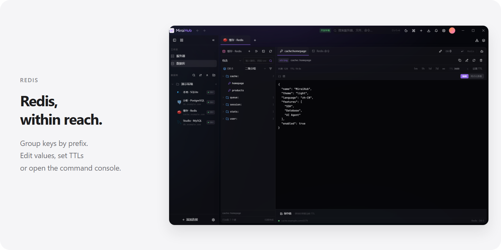
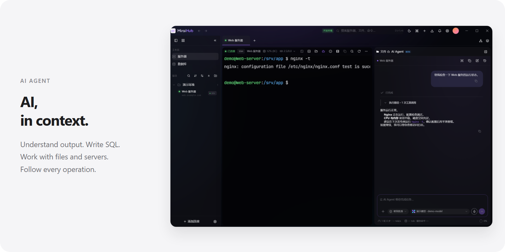
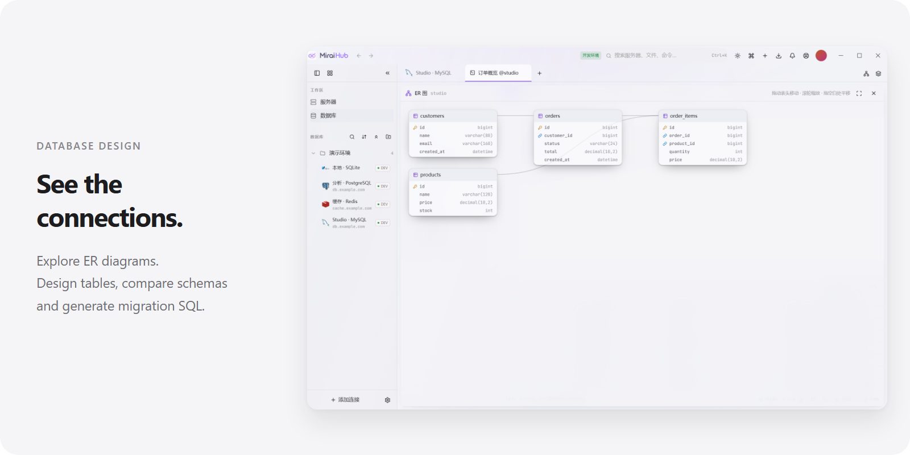
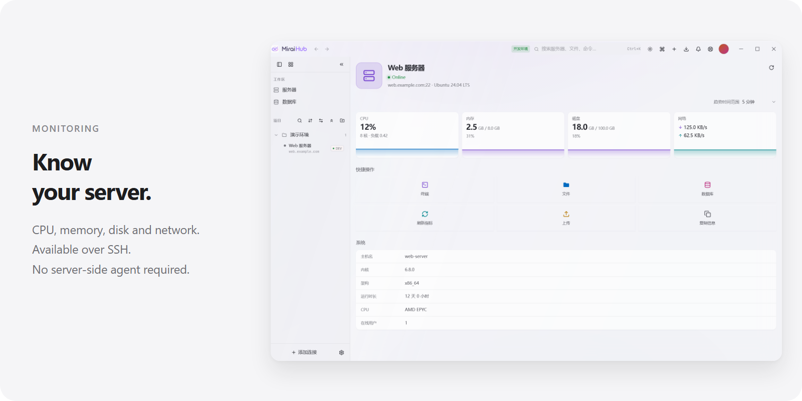
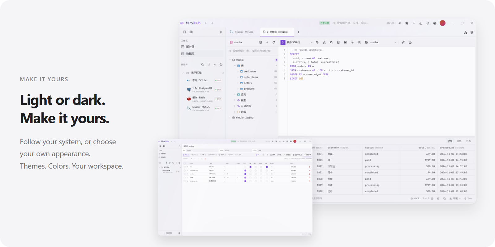

<a href="https://github.com/XiangZi7/MiraiHub/releases/latest"></a>

<p align="center"><a href="https://github.com/XiangZi7/MiraiHub/releases/latest"><strong>Download desktop app →</strong></a>　·　<a href="#quick-start">Get started</a>　·　<a href="#documentation">Docs</a>　·　<a href="README.md">简体中文</a></p>

<p align="center"><sub>Windows · macOS · Linux　/　<a href="LICENSE">MIT open source</a></sub></p>

<br />

## A closer look

<a href="docs/images/feature-ssh-dark.png"></a>

<a href="docs/images/feature-database-dark.png"></a>

<sub>MySQL · MariaDB · TiDB · PostgreSQL · SQLite</sub>

<a href="docs/images/feature-files-light.png"></a>

<a href="docs/images/feature-redis-dark.png"></a>

<a href="docs/images/feature-ai-dark.png"></a>

<a href="docs/images/feature-er-light.png"></a>

<a href="docs/images/feature-monitor-light.png"></a>

<a href="docs/images/feature-database-light.png"></a>

<sub>Current components with isolated demo data; AI-generated hero. Click a card for the original screenshot. [Image notes and table designer capture](docs/images/README.md)</sub>

<br />

## Download & install

Automated builds target Windows x64, macOS Intel / Apple Silicon, and Linux x64. Stable download links below become available in a new release containing these changes. For older versions, check the [actual assets](https://github.com/XiangZi7/MiraiHub/releases/latest).

| Architecture | Windows | macOS | Linux / Ubuntu |
| --- | --- | --- | --- |
| x86-64 (64-bit) | [EXE](https://github.com/XiangZi7/MiraiHub/releases/latest/download/MiraiHub_windows_x64_setup.exe) · [ZIP](https://github.com/XiangZi7/MiraiHub/releases/latest/download/MiraiHub_windows_x64_portable.zip) | [DMG (Intel)](https://github.com/XiangZi7/MiraiHub/releases/latest/download/MiraiHub_macos_x64.dmg) | [DEB](https://github.com/XiangZi7/MiraiHub/releases/latest/download/MiraiHub_linux_x64.deb) · [AppImage](https://github.com/XiangZi7/MiraiHub/releases/latest/download/MiraiHub_linux_x64.AppImage) |
| AArch64 (ARM64) | — | [DMG (Apple Silicon)](https://github.com/XiangZi7/MiraiHub/releases/latest/download/MiraiHub_macos_arm64.dmg) | — |

Windows ZIP requires [WebView2 Runtime](https://developer.microsoft.com/microsoft-edge/webview2/). On macOS 11+, drag the app into **Applications** first. Builds use ad-hoc signing without Apple notarization by default; allow the first launch in **Privacy & Security** if required. Linux targets Ubuntu 22.04+ / compatible WebKitGTK 4.1 distributions; AppImages need execute permission. Encrypted AI storage requires an unlocked Secret Service on Linux.

Windows installers, macOS apps, and Linux AppImages support in-app updates in **Settings → About**; update DEB and portable ZIP builds manually. Verify files with [SHA256SUMS.txt](https://github.com/XiangZi7/MiraiHub/releases/latest/download/SHA256SUMS.txt); [version.json](https://github.com/XiangZi7/MiraiHub/releases/latest/download/version.json) records the version and source commit. See the [release guide](docs/RELEASING.md).

## Quick start

1. Choose your OS and architecture from the download table above.
2. Add an SSH, local terminal or database connection.
3. To use AI, add your model endpoint and API key in **Settings → AI Agent**.

The portable version needs [WebView2 Runtime](https://developer.microsoft.com/microsoft-edge/webview2/). Existing users can check for updates in **Settings → About**.

| Action | Shortcut |
| --- | --- |
| Command palette | `Ctrl+K` |
| New local terminal | `Ctrl+T` |
| Run SQL / Redis command | `Ctrl+Enter` |
| Generate / rewrite SQL with AI | `Ctrl+K` in the SQL editor |

## Documentation

[Databases](docs/database.md) · [SSH & files](docs/ssh-operations.md) · [Redis](docs/redis.md) · [AI Agent](docs/ai-agent.md) · [Themes](docs/theme-skins.md) · [Languages](docs/languages.md)

<details>
<summary>Local development</summary>

Requires Node.js 22, pnpm 10, Rust, and platform dependencies: Windows C++ Build Tools / WebView2, macOS Xcode Command Line Tools, or Linux WebKitGTK 4.1 and related libraries. See the [release guide](docs/RELEASING.md).

```powershell
pnpm install --frozen-lockfile
pnpm tauri dev
```

`pnpm build` checks types and builds the frontend; `pnpm test` runs tests. `pnpm dev` previews the frontend; native features require the desktop app.

[Architecture](docs/FRONTEND_ARCHITECTURE.md) · [Performance](docs/PERFORMANCE.md) · [Releases](docs/RELEASING.md)

</details>

<details>
<summary>Data and operations</summary>

AI messages, attachment excerpts and tool results are sent to your configured model service. Operations follow your selected approval mode. Connection backups exclude credentials by default. See [AI Agent](docs/ai-agent.md), [SSH operations](docs/ssh-operations.md) and [Databases](docs/database.md) for data handling and feature limits.

</details>

<br />

[Report an issue](https://github.com/XiangZi7/MiraiHub/issues) · [Contribute](https://github.com/XiangZi7/MiraiHub/pulls) · [MIT License](LICENSE)

<sub>Made by <a href="https://github.com/XiangZi7">XiangZi</a></sub>
