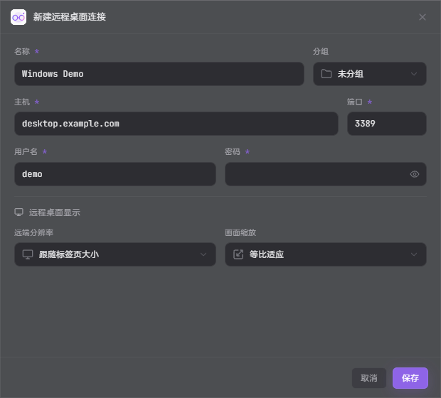
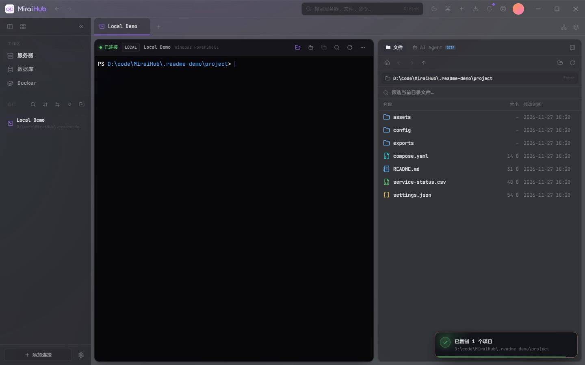
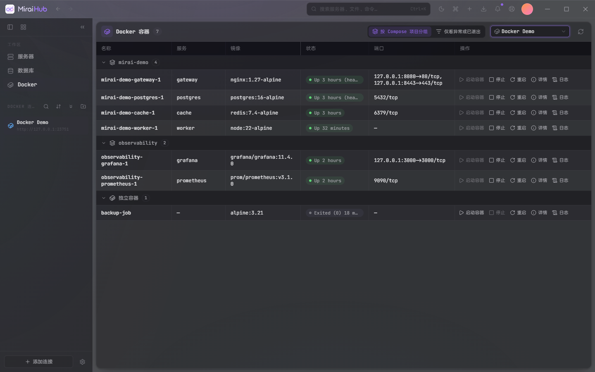

# MiraiHub

[Download desktop app](https://github.com/XiangZi7/MiraiHub/releases/latest) · [Features](#features) · [简体中文](README.md)

## Download & install

| OS | Download |
| --- | --- |
| **Windows** |   |
| **macOS** |   |
| **Linux** |   |

[Installation and updates](docs/RELEASING.md#工作流与下载) · [WebView2 for Windows ZIP](https://developer.microsoft.com/microsoft-edge/webview2/)

## Features

| Feature | Includes | Screenshots |
| --- | --- | --- |
| 🖥️ [SSH terminal](docs/ssh-operations.md) | Jump hosts, port forwarding, split panes, command and path completion, search, recording and playback | [SSH terminal](docs/images/feature-ssh-dark.png) |
| ⌨️ Local terminal | Local shells, terminal search and file browser | [Workspace](docs/images/feature-file-copy.png) |
| 🪟 Windows Remote Desktop | RDP full screen, resolution controls and two-way text and file clipboard |  |
| 📂 [File management](docs/ssh-operations.md#文件上传与下载) | Dual-pane SFTP, upload and download, folder sync, inline remote renaming, local drag-and-drop and cross-SSH copying |  [Dual-pane SFTP](docs/images/feature-files-light.png) |
| 🐳 Docker | Start, stop and restart containers, group by Compose project, inspect health and usage, filter logs |  [Container logs](docs/images/feature-docker-logs.png) |
| 📈 [Server monitoring](docs/ssh-operations.md) | CPU, memory, disk and network | [Monitoring](docs/images/feature-monitor-light.png) |
| 🗄️ [Databases](docs/database.md) | MySQL, MariaDB, TiDB, PostgreSQL and SQLite with SQL, data editing, table design and ER diagrams | [Database](docs/images/feature-database-dark.png) · [Table design](docs/images/feature-designer-light.png) · [ER diagram](docs/images/feature-er-light.png) |
| 🔑 [Redis](docs/redis.md) | Key editor, command panel, server status, slow log, big-key scans and Pub/Sub | [Key editor](docs/images/feature-redis-dark.png) |
| 🤖 [AI Agent](docs/ai-agent.md) | Terminal and database assistance, SQL generation and rewrites, custom models | [AI panel](docs/images/feature-ai-dark.png) |
| 🎨 [Appearance](docs/theme-skins.md) | Light and dark themes, skins, interface and terminal fonts, [interface languages](docs/languages.md) | [Appearance settings](docs/images/showcase-appearance-en.png) |

[Development and releases](docs/RELEASING.md) · [Report an issue](https://github.com/XiangZi7/MiraiHub/issues)

## ⚠️ Disclaimer

MiraiHub is provided under the [MIT License](LICENSE). When using third-party APIs, model services, or data sources, follow applicable laws and service terms and assume the risks of use.

## 💬 Community & support

| QQ Group 2 · 657282337 | QQ Group 1 · 442179941 |
| :---: | :---: |
|  |  |

[LINUX DO](https://linux.do/)

## 🤝 Related links

[HotPulse · Trending topics](https://hotpulse.pages.dev/) · [Anime](https://tv.yxcr.top/)

## 📈 Star history

