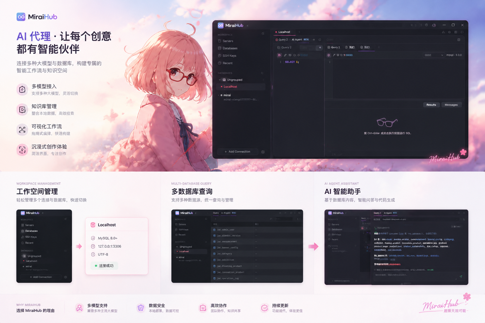

<div align="center">
  
  <h1>MiraiHub</h1>
  <p><strong>一站式服务器与开发基础设施工作台</strong></p>
  <p>SSH 终端 · 远端文件 · 数据库管理 · 服务器监控 · AI Agent</p>
  <p><strong>简体中文</strong> · <a href="README.en.md">English</a></p>
  <p>
    <a href="https://github.com/XiangZi7/MiraiHub/releases"></a>
    <a href="https://github.com/XiangZi7/MiraiHub/actions/workflows/release.yml"></a>
    
    
    
  </p>
  <p>
    <a href="https://github.com/XiangZi7/MiraiHub/releases">下载应用</a> ·
    <a href="#快速上手">快速上手</a> ·
    <a href="#文档">项目文档</a> ·
    <a href="https://github.com/XiangZi7/MiraiHub/issues">反馈问题</a>
  </p>
</div>



MiraiHub 是基于 **Tauri 2、Rust、Vue 3 和 TypeScript** 构建的桌面工作台，面向开发者与服务器维护者，将服务器连接、文件传输、数据库操作和 AI 辅助集中到同一个应用中。

在多标签工作区里连接服务器、查看运行状态、编辑远端文件或执行 SQL，需要协助时直接打开当前连接的 AI Agent 面板。

## 目录

- [功能亮点](#功能亮点)
- [界面预览](#界面预览)
- [下载与安装](#下载与安装)
- [快速上手](#快速上手)
- [数据与 AI](#数据与-ai)
- [本地开发](#本地开发)
- [项目结构](#项目结构)
- [文档](#文档)
- [参与贡献](#参与贡献)
- [许可证](#许可证)

## 功能亮点

| 功能 | 说明 |
| --- | --- |
| **SSH 与本地终端** | 多连接标签、SSH 密码与密钥认证、双终端分屏、终端搜索、常用命令与启动命令预设。 |
| **远端文件管理** | 通过 SFTP 浏览、上传和下载文件，集中查看传输任务；支持远端文本编辑、保存预览与冲突检查。 |
| **数据库工作台** | 支持 MySQL / PostgreSQL，提供对象树、表数据浏览与编辑、表结构设计、SQL 编辑器、查询历史与 SQL 导入导出。 |
| **服务器监控** | 通过 SSH 采集 Linux 服务器的 CPU、内存、磁盘、网络速率和运行时间，无需额外安装监控 Agent。 |
| **AI Agent** | 在 SSH 与数据库工作区中对话，支持多份模型配置、工具调用和聊天历史；自定义 Shell / SQL 执行前需确认。 |
| **日常运维** | SSH 本地端口转发、批量服务器命令、SSH 密钥管理，以及连接分组、标签与备份恢复。 |
| **个性化工作区** | 简体中文 / English、跟随系统语言、主题皮肤、自定义配色与背景、界面缩放及可调整的分屏布局。 |

## 界面预览

<!-- 维护者：四个位置暂用同一占位图。补图路径与替换步骤见 docs/images/README.md。 -->
<table>
  <tr>
    <td width="50%" align="center">
      <strong>SSH 终端与远端文件</strong><br /><br />
      <!-- 替换 src 为 docs/images/ssh-workspace.png -->
      <br />
      <sub>终端操作、文件浏览与传输</sub>
    </td>
    <td width="50%" align="center">
      <strong>数据库工作台</strong><br /><br />
      <!-- 替换 src 为 docs/images/database-workspace.png -->
      <br />
      <sub>对象管理、数据编辑与 SQL 查询</sub>
    </td>
  </tr>
  <tr>
    <td width="50%" align="center">
      <strong>服务器监控</strong><br /><br />
      <!-- 替换 src 为 docs/images/server-monitoring.png -->
      <br />
      <sub>CPU、内存、磁盘与网络状态</sub>
    </td>
    <td width="50%" align="center">
      <strong>AI Agent</strong><br /><br />
      <!-- 替换 src 为 docs/images/ai-agent.png -->
      <br />
      <sub>连接内对话、操作确认与历史记录</sub>
    </td>
  </tr>
</table>

## 下载与安装

前往 [GitHub Releases](https://github.com/XiangZi7/MiraiHub/releases)，选择所需版本的附件。

| 平台 | 当前发布情况 |
| --- | --- |
| Windows x64 | 发布流程提供安装程序与免安装 ZIP。 |
| macOS / Linux | 当前发布流程未提供构建产物。 |

| 附件 | 用途 |
| --- | --- |
| `MiraiHub_<version>_windows_x64_setup.exe` | Windows 安装程序，按向导完成安装。 |
| `MiraiHub_<version>_windows_x64_portable.zip` | 解压后运行 `miraihub.exe`。 |
| `SHA256SUMS.txt` | 用于核对下载文件的 SHA-256。 |
| `version.json` | 记录版本、标签、源码提交与平台信息。 |

免安装版需要系统已安装 **WebView2 Runtime**；用户数据仍保存在应用数据目录，不随 ZIP 放置。当前发布流程未配置代码签名，Windows 可能显示“未知发布者”。更多说明见[发版文档](docs/RELEASING.md)。

## 快速上手

1. **添加连接**：在侧栏新建 SSH、本地终端或数据库连接，填写地址、端口和认证信息；可使用分组与标签整理环境。
2. **打开工作区**：连接 SSH 后使用终端、文件面板和服务器概览；连接数据库后浏览对象、编辑数据或运行 SQL。
3. **配置 AI（可选）**：进入「设置 → AI Agent」，添加服务地址、API 格式、模型 ID 与 API Key，保存并测试连接。
4. **开始协作**：在 SSH 或数据库工作区打开 AI Agent 标签，或使用分屏；AI 提议执行自定义命令或 SQL 时，先核对目标与完整内容，再确认执行。

AI 需要自行配置支持工具调用的模型服务。应用提供 OpenAI、Claude、DeepSeek、豆包、Gemini 与自定义地址模板，实际采用 **OpenAI Chat Completions 兼容格式**或 **Claude Messages 格式**；Gemini 模板使用 OpenAI 兼容入口。配置方法与协议范围见 [AI Agent 文档](docs/ai-agent.md)。

## 数据与 AI

- **模型请求**：对话内容与工具结果会发送给你配置的模型服务；读取本机聊天历史本身不会触发模型请求。
- **本地存储**：Windows 上的 AI 配置与聊天历史使用当前系统用户的 DPAPI 加密。普通连接配置使用本地 WebView 存储；选择保存的连接密码和私钥口令目前也随配置存储。
- **连接备份**：默认导出不包含凭据；需要包含凭据时，必须设置独立备份密码。备份加密与本地连接存储是独立机制。

详细行为见 [AI Agent](docs/ai-agent.md) 与 [SSH 运维及连接备份](docs/ssh-operations.md)。

## 本地开发

### 环境准备

以下版本与仓库当前的 Windows 发布工作流保持一致：

| 依赖 | 版本 / 要求 |
| --- | --- |
| Node.js | `22.22.2` |
| pnpm | `10.33.0`，由 `package.json` 的 `packageManager` 指定 |
| Rust | `1.96.0`，包含 Cargo |
| Windows 原生构建工具 | Visual Studio C++ Build Tools 与 Windows SDK |
| WebView | WebView2 Runtime |

### 获取源码并启动

```powershell
git clone https://github.com/XiangZi7/MiraiHub.git
cd MiraiHub
pnpm install --frozen-lockfile
pnpm tauri dev
```

`pnpm tauri dev` 会同时启动前端开发服务与桌面应用。仅运行 `pnpm dev` 可预览前端，SSH、数据库等原生能力需要在 Tauri 应用中使用。

### 检查与构建

```powershell
# 前端工具与发布逻辑测试
pnpm test

# Rust 后端测试
cargo test --locked --manifest-path src-tauri/Cargo.toml --lib

# Vue / TypeScript 检查与前端生产构建
pnpm build

# 应用版本一致性检查
pnpm version:check

# 构建 Windows NSIS 安装包
pnpm release:build
```

### 版本发布

维护者提交待发布代码后，可先预览版本变化，再执行发版：

```powershell
pnpm release --dry-run
pnpm release
```

`pnpm release` 默认递增补丁版本，也可使用 `pnpm release minor` 或 `pnpm release major`。正式命令要求工作区干净且具有 `origin` 推送权限，会同步版本文件、创建提交，并推送当前分支与新标签，触发 GitHub Actions 测试、打包和发布。

首次发布、测试版标签、失败重试与本地附件打包见[发版说明](docs/RELEASING.md)。

## 项目结构

```text
MiraiHub/
├── src/                  # Vue + TypeScript 前端
│   ├── api/              # Tauri IPC 与持久化接口
│   ├── components/       # 工作区与通用 UI 组件
│   ├── composables/      # 会话与交互逻辑
│   ├── i18n/             # 中英文语言资源
│   ├── layouts/          # 工作区布局
│   ├── pages/            # 工作区与独立窗口页面
│   ├── router/           # 路由与窗口入口
│   └── stores/           # Pinia 状态管理
├── src-tauri/            # Tauri + Rust 桌面后端
│   └── src/              # SSH、SFTP、数据库、AI 与平台集成
├── public/               # 应用静态资源
├── docs/                 # 功能、架构与发版文档
│   └── images/           # README 产品图与截图占位
├── scripts/              # 版本管理与打包脚本
├── tests/                # 自动化测试与界面验证夹具
└── .github/workflows/    # GitHub Actions 发布流程
```

## 文档

| 文档 | 内容 |
| --- | --- |
| [AI Agent](docs/ai-agent.md) | 模型配置、聊天历史、执行确认与数据处理。 |
| [SSH 运维](docs/ssh-operations.md) | 端口转发、远端编辑、批量命令与连接备份。 |
| [主题皮肤](docs/theme-skins.md) | 主题、自定义背景、配色与分屏布局。 |
| [界面语言](docs/languages.md) | 中英文切换与跟随系统语言。 |
| [前端架构](docs/FRONTEND_ARCHITECTURE.md) | 目录职责、路由、会话缓存与 Store 约定。 |
| [性能说明](docs/PERFORMANCE.md) | 性能相关实现与验证记录。 |
| [发版说明](docs/RELEASING.md) | 自动发布、版本管理与本地打包。 |
| [截图维护](docs/images/README.md) | 产品图命名与预留截图位的替换方法。 |

## 参与贡献

欢迎通过 [Issues](https://github.com/XiangZi7/MiraiHub/issues) 反馈问题、提出需求，或提交 Pull Request 改进代码、文档与翻译。

- **反馈问题**：附上应用版本、操作系统、复现步骤、预期行为与实际结果；截图和日志请先移除密码、私钥、API Key 等敏感信息。
- **提交改动**：Fork 仓库并创建分支，让每个 PR 聚焦一个问题，说明改动内容与验证方式；涉及功能变化时同步更新相关文档。
- **验证改动**：代码改动按影响范围运行上面的测试与构建命令；文档改动检查链接、代码示例和中英文内容是否一致。

## 许可证

仓库暂未添加 `LICENSE` 文件，具体许可证待项目维护者确认。
