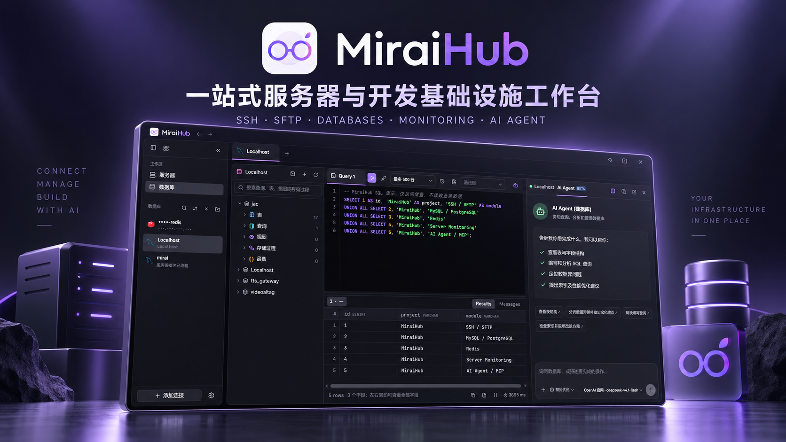
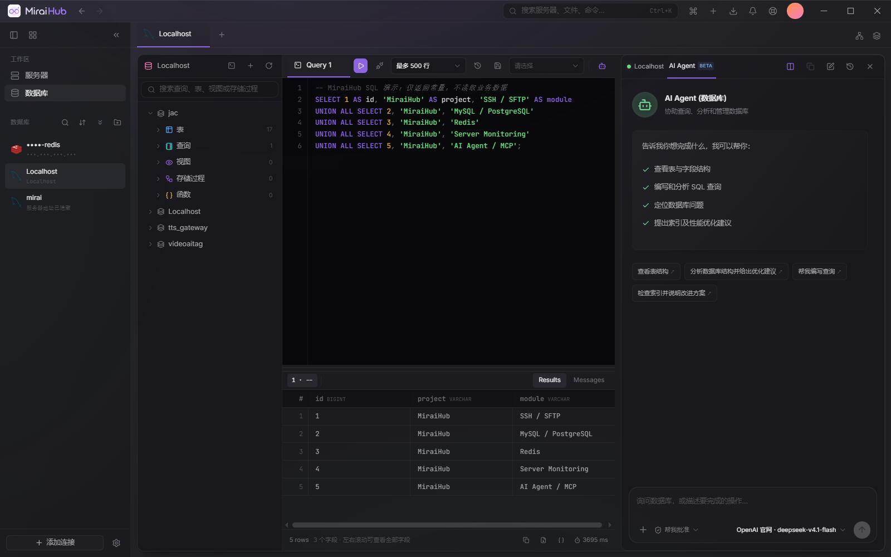
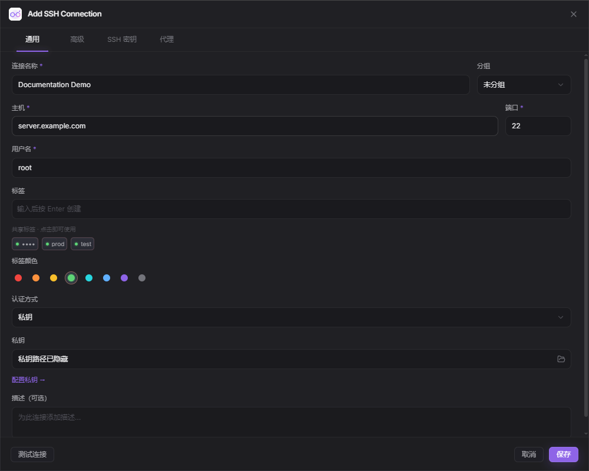
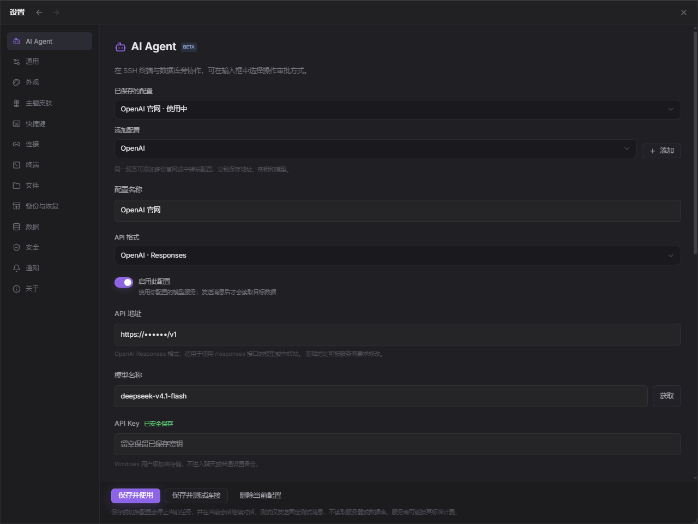
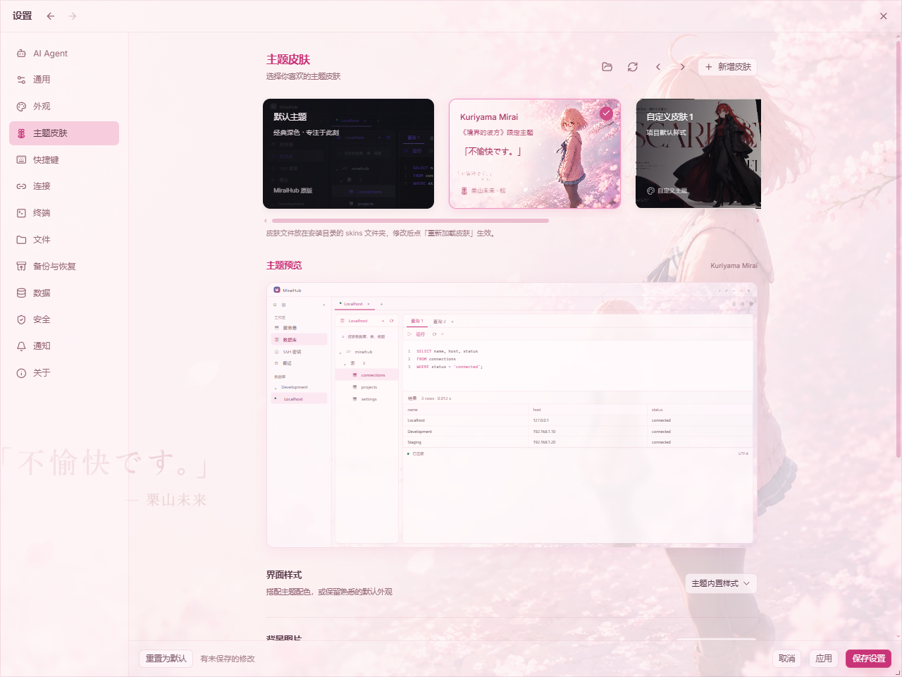
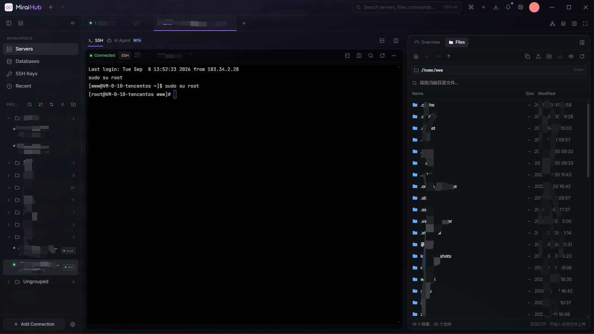
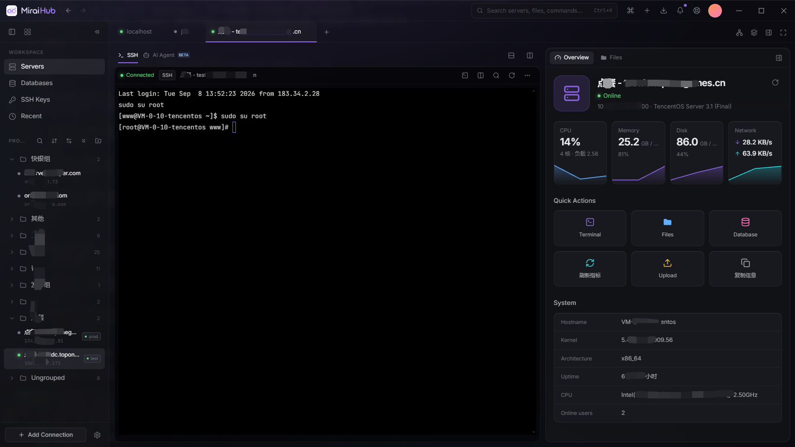

<div align="center">
  
  <h1>MiraiHub</h1>
  <p><strong>一站式服务器与开发基础设施工作台</strong></p>
  <p>SSH 终端 · 远端文件 · 数据库 · 服务器监控 · AI Agent</p>
  <p>
    <a href="https://github.com/XiangZi7/MiraiHub/releases"></a>
    <a href="https://github.com/XiangZi7/MiraiHub/releases"></a>
    <a href="https://github.com/XiangZi7/MiraiHub/actions/workflows/release.yml"></a>
    
    
    
  </p>
  <p>
    <a href="https://github.com/XiangZi7/MiraiHub/releases/latest"><strong>下载最新版</strong></a> ·
    <a href="#快速上手">快速上手</a> ·
    <a href="#文档">文档</a> ·
    <a href="https://github.com/XiangZi7/MiraiHub/issues">反馈问题</a> ·
    <a href="README.en.md">English</a>
  </p>
</div>

<br />



MiraiHub 是一款基于 **Tauri 2 + Rust + Vue 3** 的桌面工作台。它把服务器连接、文件传输、数据库操作、监控和 AI 辅助放进同一个多标签窗口，面向开发者与服务器维护者。

适合在开发、测试和服务器维护中集中管理多个环境：用 SSH 检查服务，用文件面板传输与编辑配置，用数据库工作台查询数据，再让 AI Agent 在当前连接的上下文中辅助分析。

> 顶部图片为 AI 生成的产品宣传图；下方「界面预览」使用实际运行的 Windows 桌面应用截图。功能与入口以当前版本为准。

## 功能亮点

| | 功能 | 说明 |
| :-: | --- | --- |
| 🖥️ | **SSH 与本地终端** | 多连接标签、密码 / 密钥认证、双终端分屏、终端搜索、常用命令与启动命令预设 |
| 📁 | **远端文件** | SFTP 浏览、新建文件与文件夹、拖拽上传、下载，统一的传输中心；远端文本可直接编辑保存 |
| 🗄️ | **数据库工作台** | MySQL / PostgreSQL：对象树、数据编辑、表结构设计、SQL 与导入导出；Redis：键扫描、值预览与编辑、TTL 和命令面板 |
| 📈 | **服务器监控** | 通过 SSH 采集 CPU、内存、磁盘、网络与运行时间，无需在服务器安装 Agent |
| 🤖 | **AI Agent** | 在 SSH、数据库与 Redis 工作区内对话，支持多模型配置、流式回复、附件、聊天历史与上下文压缩；可选逐次审批 / 自动只读 / 完全访问 |
| 🔌 | **MCP 扩展** | 连接本地 stdio 或远程 Streamable HTTP 服务器，按连接类型提供外部工具，并显示调用参数供审批 |
| 🛠️ | **日常运维** | 本地端口转发、批量命令、SSH 密钥管理、连接分组与标签、加密备份与恢复 |
| 🎨 | **个性化** | 中 / 英文并跟随系统、主题皮肤、自定义配色与背景、界面缩放、可调整分屏布局 |

## 界面预览

**数据库工作台与 AI 分屏**：在实际运行的桌面版中连接本机 MySQL，编辑 SQL 并查看查询结果。图中查询只返回示例常量。



<table>
  <tr>
    <td width="50%" align="center">
      <a href="docs/images/ssh-connection.png"></a><br />
      <sub><b>SSH 连接、认证与标签配置</b></sub>
    </td>
    <td width="50%" align="center">
      <a href="docs/images/redis-connection.png"></a><br />
      <sub><b>Redis 连接与逻辑数据库选择</b></sub>
    </td>
  </tr>
  <tr>
    <td width="50%" align="center">
      <a href="docs/images/ai-agent.png"></a><br />
      <sub><b>AI 模型配置与 API 协议选择</b></sub>
    </td>
    <td width="50%" align="center">
      <a href="docs/images/skin.png"></a><br />
      <sub><b>主题皮肤、背景与实时预览</b></sub>
    </td>
  </tr>
</table>

上方五张截图采集自 **v2.0.25 Windows 桌面开发版**。连接表单使用未保存的示例地址；主题卡片中的窗口是应用自带的皮肤预览。服务地址、项目名和本地私钥路径已隐藏，点击图片可查看原图。

<details>
<summary><b>查看 SSH 文件与服务器监控的历史实机截图</b></summary>

以下是仓库保留的较早版本截图，用于展示 SSH 文件与监控布局。本次采集时已有 SSH 连接超时或断开，因此未更新这两张图；界面入口可能与当前版本不同。





</details>

## 下载与安装

前往 [Releases](https://github.com/XiangZi7/MiraiHub/releases/latest) 下载。当前仅提供 **Windows x64** 构建，macOS / Linux 暂未发布。

| 文件 | 说明 |
| --- | --- |
| `MiraiHub_<version>_windows_x64_setup.exe` | 安装版，按向导完成安装 |
| `MiraiHub_<version>_windows_x64_portable.zip` | 免安装版，解压后运行 `miraihub.exe`，需已安装 [WebView2 Runtime](https://developer.microsoft.com/microsoft-edge/webview2/) |
| `SHA256SUMS.txt` / `version.json` | 校验值与版本、源码提交信息 |

> 安装包暂未做代码签名，Windows SmartScreen 可能提示“未知发布者”，选择「仍要运行」即可。用户数据保存在系统应用数据目录，不随免安装包移动。

## 快速上手

1. **添加连接**：在侧栏新建 SSH、本地终端或数据库连接，填写地址、端口与认证信息；可用分组和标签整理。
2. **进入工作区**：SSH 连接后可使用终端、文件面板与服务器概览；数据库连接后可浏览对象、编辑数据或执行 SQL。
3. **配置 AI（可选）**：「设置 → AI Agent」中添加服务地址、API 格式、模型 ID 和 API Key，保存后测试连接。
4. **与 AI 协作**：在工作区打开 AI Agent 标签或分屏。AI 提议执行命令或 SQL 时，先核对内容再确认。

AI 功能需要自备支持工具调用的模型服务，内置 OpenAI、Claude、DeepSeek、豆包、Gemini 与自定义模板。支持 **OpenAI Chat Completions 兼容格式**、**OpenAI Responses** 和 **Claude Messages**；请根据服务商的接口选择对应协议。Gemini 模板使用 OpenAI 兼容入口。详见 [AI Agent 文档](docs/ai-agent.md)。

### 常用快捷键

| 操作 | 默认快捷键 |
| --- | --- |
| 命令面板 | `Ctrl+K` |
| 新建本地终端 | `Ctrl+T` |
| 搜索入口 | `Ctrl+Shift+F` |
| 远端文件面板 | `Ctrl+O` |
| 搜索终端内容 | `Ctrl+F` |
| 执行 SQL / Redis 命令 | `Ctrl+Enter` |
| 全屏 / 退出全屏 | `F11` / `Esc` |

全局快捷键可在「设置 → 快捷键」中调整，终端和查询快捷键在对应工作区生效。

## 支持范围

| 模块 | 当前支持 | 边界 |
| --- | --- | --- |
| 桌面平台 | Windows x64 | 当前发布流程仅构建 Windows；macOS / Linux 暂未发布 |
| SSH | 密码、私钥、SOCKS5 / HTTP CONNECT 代理、本地端口转发 | 端口转发监听本机回环地址；暂不提供反向转发与动态 SOCKS 转发 |
| 关系型数据库 | MySQL、PostgreSQL | SQL 编辑、表结构设计与 SQL 导入导出用于这两类数据库 |
| Redis | 单节点、逻辑 DB 切换、SCAN、六种常见数据类型预览 | 暂不提供 Cluster 路由与 Sentinel 发现；String 编辑需要 Redis 6.0+ 及相应权限 |
| 服务器监控 | 通过 SSH 读取系统与资源指标 | 需要服务器允许相关系统命令；不需要另装监控 Agent |
| AI Agent | 三种 API 格式、工具调用、MCP 扩展 | 需自行配置模型服务；模型应支持所选协议及工具调用 |

## 隐私与安全

- **模型请求**：对话内容、主动添加的附件和工具结果发送到你自己配置的模型服务；不会自动读取 SSH 密码、私钥或终端缓冲区。
- **本地存储**：Windows 上 AI 配置与聊天历史使用当前用户的 DPAPI 加密；连接配置及选择保存的密码、私钥口令存放在本地 WebView 存储中。
- **连接备份**：默认不导出凭据；如需包含，必须设置独立的备份密码。
- **操作审批**：AI 操作按所选权限模式执行；逐次审批与自动只读模式下，外部 MCP 工具都需要单独确认。停止任务不会回滚已经执行的操作。

## 常见问题

<details>
<summary><b>免安装版打不开，或出现 WebView2 相关错误？</b></summary>

先完整解压 ZIP，再运行 `miraihub.exe`，并保留随包提供的资源文件夹。确认系统已安装 WebView2 Runtime；安装版会按打包配置安装缺失的运行时。

</details>

<details>
<summary><b>只启动 <code>pnpm dev</code>，为什么 SSH、数据库或 AI 无法使用？</b></summary>

`pnpm dev` 启动浏览器前端，原生功能由 Rust 后端提供。请使用 `pnpm tauri dev` 启动完整桌面应用。

</details>

<details>
<summary><b>模型服务可以在其他客户端使用，这里却报协议错误？</b></summary>

核对基础地址、模型 ID、API Key 和 API 格式。使用 `/responses` 的服务应选择「OpenAI · Responses」，Claude 原生接口选择 Messages。服务还需支持工具调用，程序不会自动切换协议。完整说明见 [AI Agent](docs/ai-agent.md)。

</details>

<details>
<summary><b>换电脑时如何迁移连接？</b></summary>

在「设置 → 备份与恢复」导出，在新电脑读取并预览恢复计划。包含凭据时设置独立备份密码；私钥文件、AI 配置和聊天历史不在连接备份内，需分别处理。详细步骤见 [SSH 运维](docs/ssh-operations.md#连接备份)。

</details>

## 本地开发

| 依赖 | 版本 |
| --- | --- |
| Node.js | 22.22.2 |
| pnpm | 10.33.0（由 `packageManager` 字段锁定） |
| Rust | 1.96.0 |
| Windows | Visual Studio C++ Build Tools、Windows SDK、WebView2 Runtime |

```powershell
git clone https://github.com/XiangZi7/MiraiHub.git
cd MiraiHub
pnpm install --frozen-lockfile
pnpm tauri dev          # 启动前端与桌面应用
```

```powershell
pnpm test                                                        # 前端与发布逻辑测试
cargo test --locked --manifest-path src-tauri/Cargo.toml --lib   # Rust 后端测试
pnpm build                                                       # 类型检查与前端构建
pnpm release:build                                               # 构建 Windows 安装包
pnpm release [patch|minor|major] [--dry-run]                     # 发版：同步版本、打标签并推送
```

仅运行 `pnpm dev` 可预览前端界面，SSH、数据库等原生能力需在 Tauri 应用中使用。发版细节见 [发版说明](docs/RELEASING.md)。

## 文档

| 文档 | 内容 |
| --- | --- |
| [AI Agent](docs/ai-agent.md) | 模型配置、聊天历史、执行确认与数据处理 |
| [Redis 工作台](docs/redis.md) | 连接、键值预览、TTL、命令面板与 AI 工具 |
| [SSH 运维](docs/ssh-operations.md) | 端口转发、远端编辑、批量命令与连接备份 |
| [主题皮肤](docs/theme-skins.md) | 主题、自定义背景、配色与分屏布局 |
| [界面语言](docs/languages.md) | 中英文切换与跟随系统语言 |
| [前端架构](docs/FRONTEND_ARCHITECTURE.md) | 目录职责、路由、会话缓存与 Store 约定 |
| [性能说明](docs/PERFORMANCE.md) | 性能相关实现与验证记录 |
| [发版说明](docs/RELEASING.md) | 自动发布、版本管理与本地打包 |
| [截图维护](docs/images/README.md) | README 图片的命名与替换方式 |

## 参与贡献

欢迎通过 [Issues](https://github.com/XiangZi7/MiraiHub/issues) 反馈问题或提出需求，也欢迎提交 Pull Request。

- **反馈问题**：附上应用版本、系统版本、复现步骤与预期结果；截图和日志请先去除密码、私钥、API Key。
- **提交改动**：每个 PR 聚焦一个问题，说明改动与验证方式；功能变化请同步更新文档与中英文翻译。

## 许可证

仓库暂未添加 `LICENSE` 文件，许可证待维护者确认。

<div align="center">
  <sub>Made with ❤️ by <a href="https://github.com/XiangZi7">XiangZi</a></sub>
</div>
