#  MiraiHub

[下载桌面版](https://github.com/XiangZi7/MiraiHub/releases/latest) · [功能](#功能) · [界面预览](#screenshots) · [English](README.en.md)

## 📦 下载与安装

| 系统 | 下载 |
| --- | --- |
| **Windows** |   |
| **macOS** |   |
| **Linux** |   |

[安装与更新说明](docs/RELEASING.md#工作流与下载) · [Windows ZIP 所需的 WebView2](https://developer.microsoft.com/microsoft-edge/webview2/)

## 🧰 功能

| 功能 | 支持 |
| --- | --- |
| 🖥️ [SSH 终端](docs/ssh-operations.md) | 跳板机、端口转发、分屏、命令与路径补全、搜索、录制与回放 |
| ⌨️ 本地终端 | 本地 Shell、终端搜索、文件面板 |
| 🪟 Windows 远程桌面 | RDP 全屏与分辨率设置、双向文本和文件剪贴板 |
| 📂 [文件管理](docs/ssh-operations.md#文件上传与下载) | SFTP 双栏、上传下载、目录同步、远端文件行内重命名、本地拖放与跨 SSH 复制 |
| 🐳 Docker | 容器启停与重启、Compose 分组、健康与资源详情、日志筛选 |
| 📈 [服务器监控](docs/ssh-operations.md) | CPU、内存、磁盘与网络 |
| 🗄️ [数据库](docs/database.md) | MySQL、MariaDB、TiDB、PostgreSQL、SQLite，支持 SQL 编辑、数据编辑、表结构设计和 ER 图 |
| 🔑 [Redis](docs/redis.md) | 键值编辑、命令面板、实例状态、慢日志、大键扫描、发布与订阅 |
| 🤖 [AI Agent](docs/ai-agent.md) | 终端与数据库助手、SQL 生成与改写、自定义模型 |
| 🎨 [外观与主题](docs/theme-skins.md) | 深浅色、皮肤、界面与终端字体、[界面语言](docs/languages.md) |

## 🖼️ 界面预览

<table>
  <tr>
    <td align="center" width="50%" valign="top"><strong>SSH 终端与远端文件</strong> <a href="docs/images/feature-ssh-dark.png">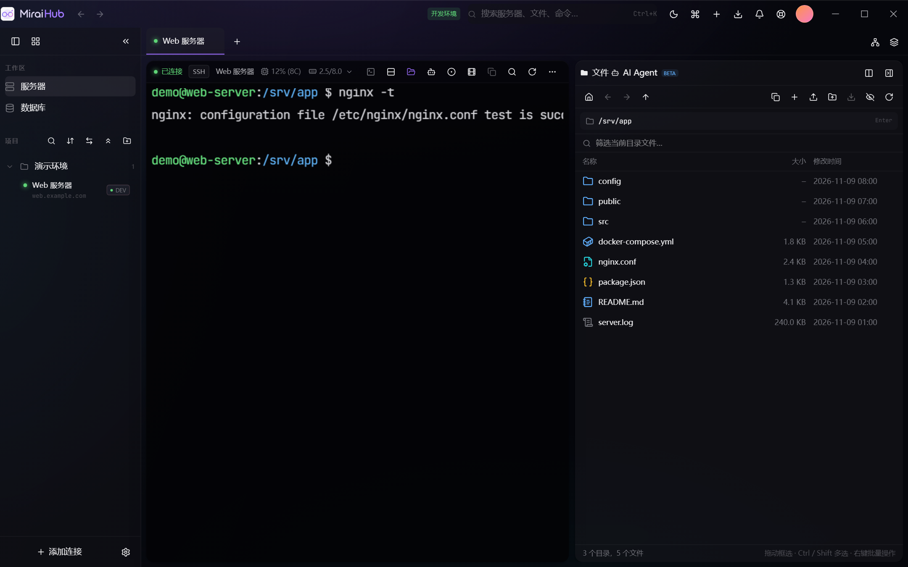</a></td>
    <td align="center" width="50%" valign="top"><strong>本地与远端双栏文件</strong> <a href="docs/images/feature-files-light.png">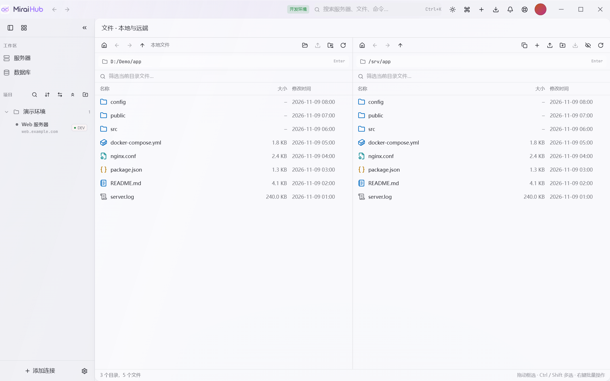</a></td>
  </tr>
  <tr>
    <td align="center" width="50%" valign="top"><strong>Docker 容器管理</strong> <a href="docs/images/feature-docker.png">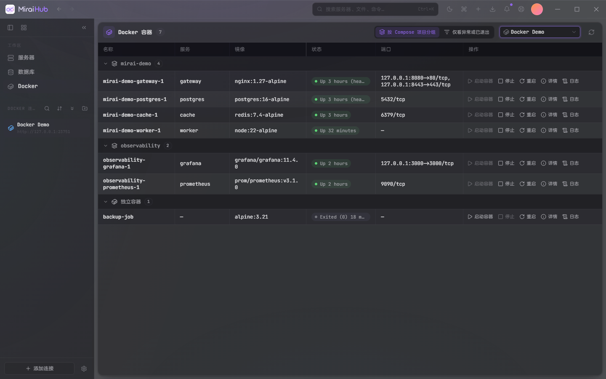</a></td>
    <td align="center" width="50%" valign="top"><strong>Docker 容器日志</strong> <a href="docs/images/feature-docker-logs.png">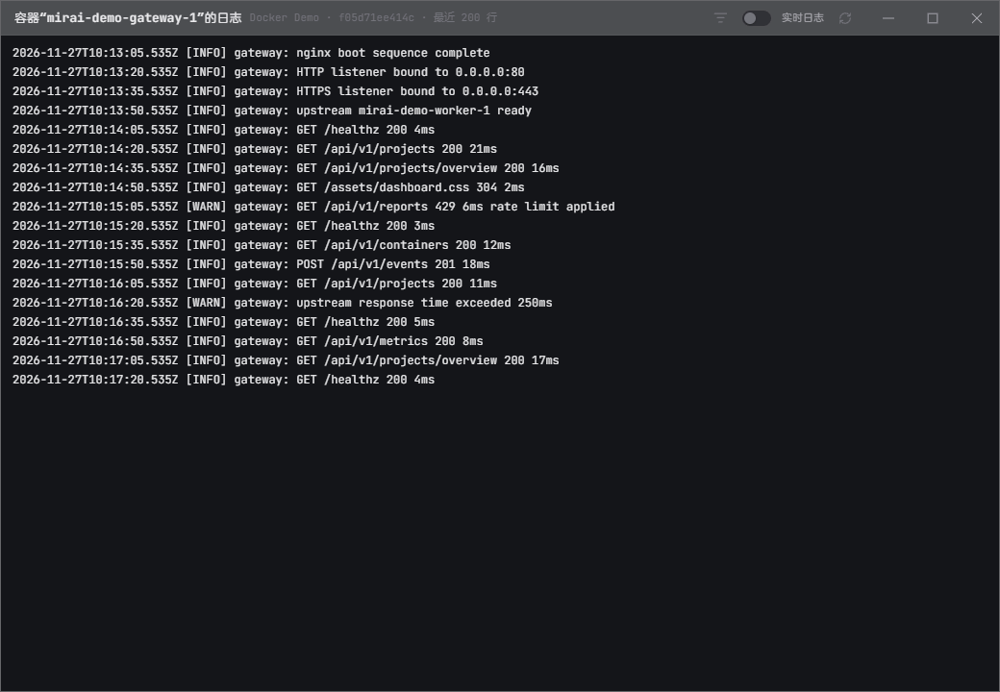</a></td>
  </tr>
  <tr>
    <td align="center" width="50%" valign="top"><strong>本地终端与文件复制</strong> <a href="docs/images/feature-file-copy.png">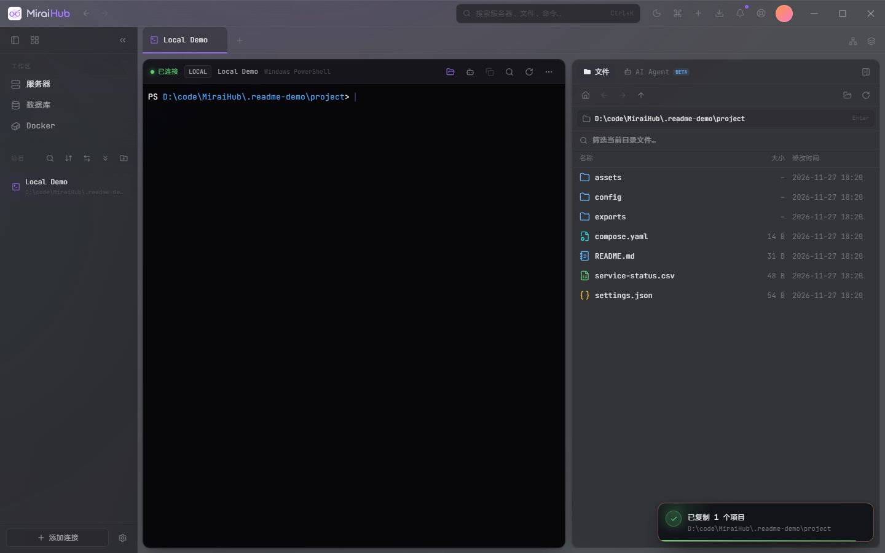</a></td>
    <td align="center" width="50%" valign="top"><strong>Windows 远程桌面连接设置</strong> <a href="docs/images/feature-rdp.png">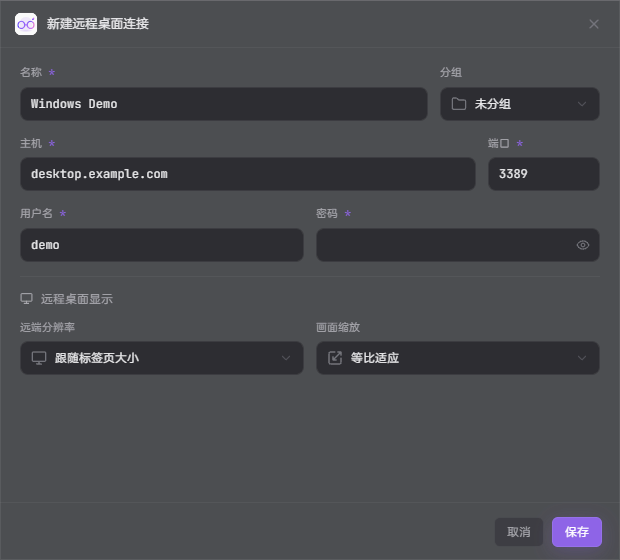</a></td>
  </tr>
  <tr>
    <td align="center" width="50%" valign="top"><strong>数据库 · 深色</strong> <a href="docs/images/feature-database-dark.png">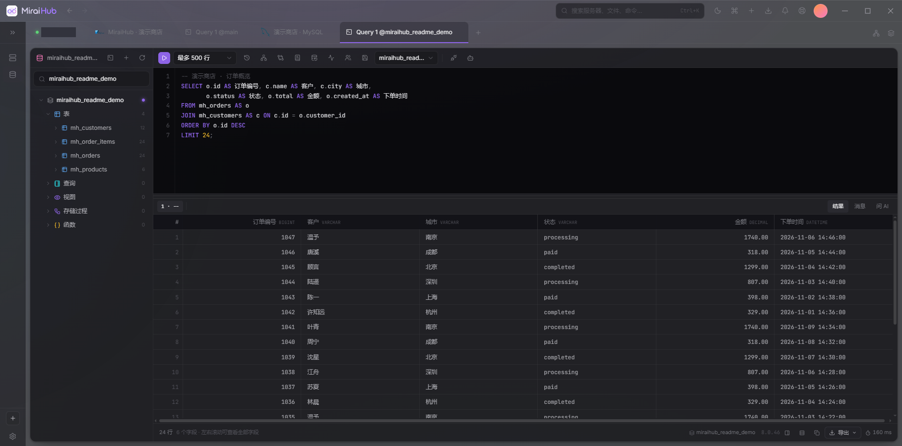</a></td>
    <td align="center" width="50%" valign="top"><strong>数据库 · 浅色</strong> </td>
  </tr>
  <tr>
    <td align="center" width="50%" valign="top"><strong>表结构设计</strong> <a href="docs/images/feature-designer-light.png">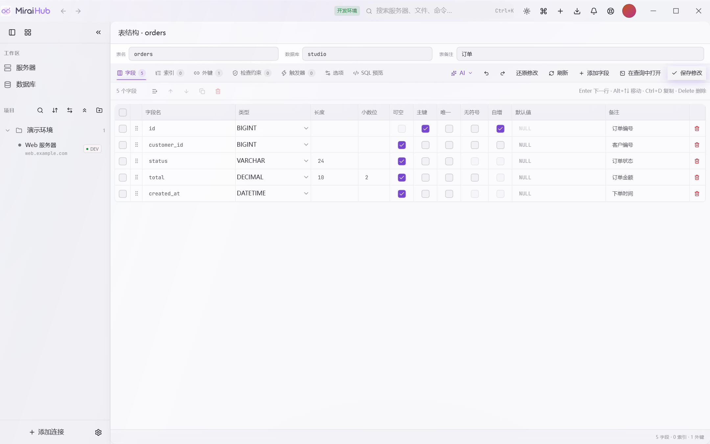</a></td>
    <td align="center" width="50%" valign="top"><strong>ER 关系图</strong> </td>
  </tr>
  <tr>
    <td align="center" width="50%" valign="top"><strong>Redis 键值编辑</strong> <a href="docs/images/feature-redis-dark.png">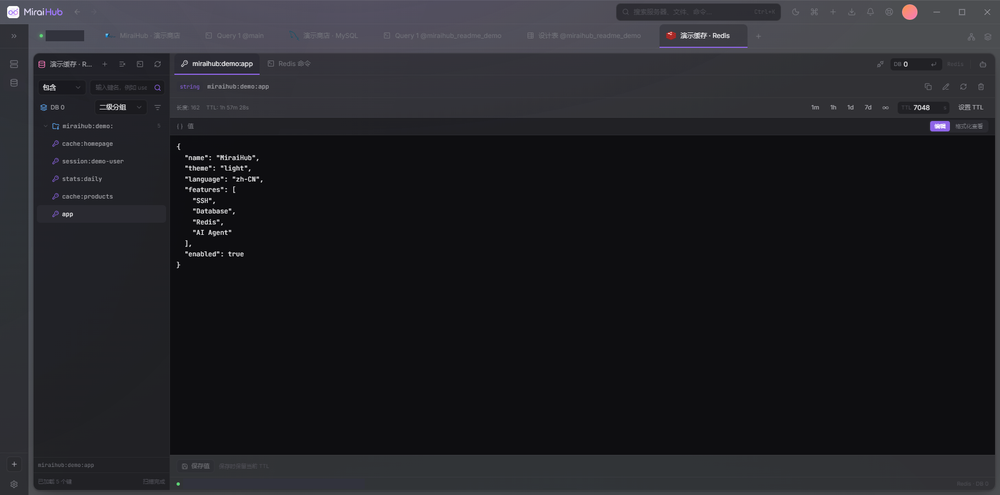</a></td>
    <td align="center" width="50%" valign="top"><strong>AI Agent</strong> <a href="docs/images/feature-ai-dark.png">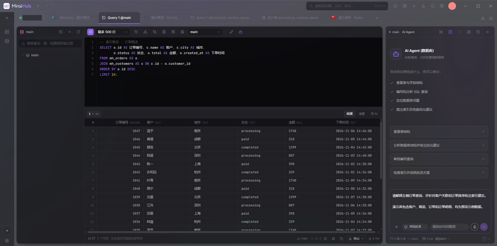</a></td>
  </tr>
  <tr>
    <td align="center" width="50%" valign="top"><strong>服务器监控</strong> </td>
    <td align="center" width="50%" valign="top"><strong>外观设置</strong> <a href="docs/images/showcase-appearance-zh.png">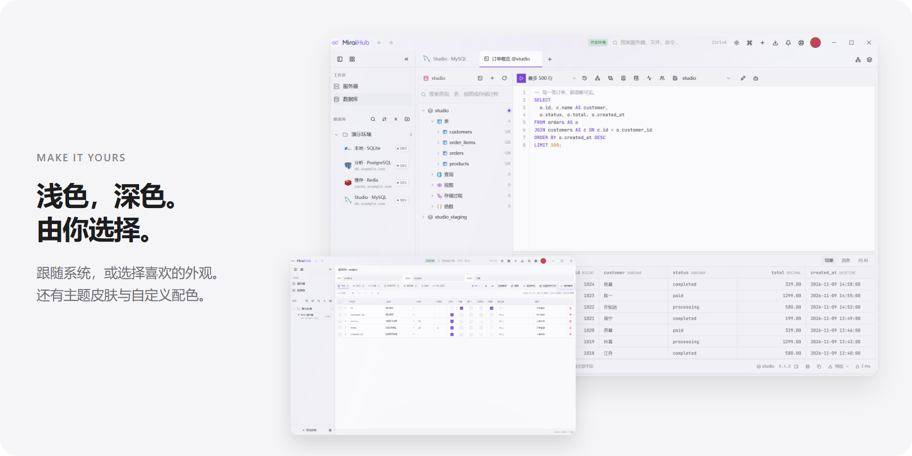</a></td>
  </tr>
</table>

[本地开发与发布](docs/RELEASING.md) · [问题反馈](https://github.com/XiangZi7/MiraiHub/issues)

## ⚠️ 免责声明

MiraiHub 按 [MIT 许可证](LICENSE) 提供。使用第三方 API、模型服务或数据源时，请遵守适用法律及服务条款，并自行承担使用风险。

## 💬 交流与支持

| QQ 交流 2 群 · 657282337 | QQ 交流群 · 442179941 |
| :---: | :---: |
|  |  |

[LINUX DO](https://linux.do/)

## 🤝 友情链接

[HotPulse · 全网热点聚合](https://hotpulse.pages.dev/) · [番剧](https://tv.yxcr.top/)

## 📈 Star 趋势

