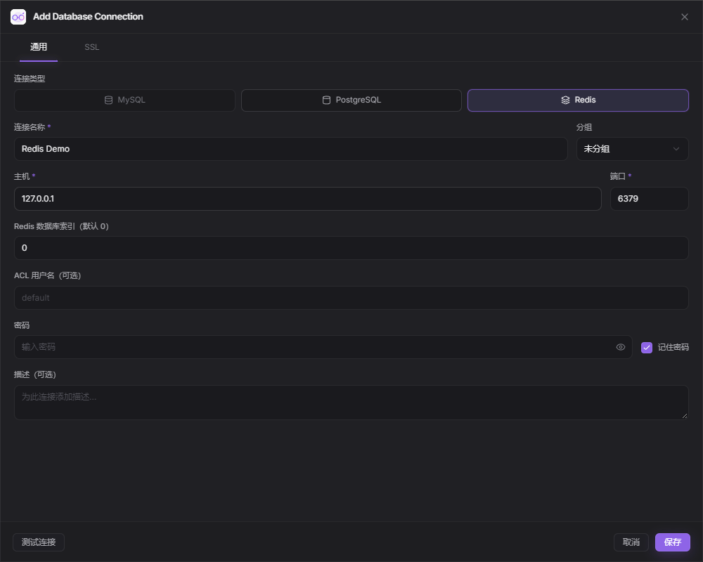

# Redis 工作台

## 界面预览

截图中的 `127.0.0.1:6379` 是未保存的配置示例；请填写自己的 Redis 地址、认证与 DB 索引。

## 添加连接

在「数据库 → 新建连接」中选择 Redis。默认端口为 `6379`，数据库索引默认为 `0`；用户名可留空，ACL 用户填写相应用户名。密码可按现有设置保存，也可在认证失败后临时输入。

- TLS 可选择 `Disable` 或 `Verify Full`。启用 TLS 时验证服务端证书与主机名，支持自定义 CA 和客户端证书/私钥。
- 顶部 DB 输入框用于切换逻辑数据库，服务器决定可用索引范围。当前支持单节点直连，不提供 Cluster 路由或 Sentinel 发现。
- 键列表通过 `SCAN` 增量加载，支持 `user:*` 等 Redis glob 模式。扫描可能返回重复键或空批次；界面去重，游标未结束时可继续扫描。
- 上方搜索默认按「包含」匹配，可切换「前缀」或「匹配模式」。例如包含 `token`、前缀 `user:`、匹配模式 `user:*`。前两种方式会自动转义通配符，键名中的 `*`、`?` 可以按字面搜索。
- 键名按冒号前缀分组，默认两级，可切换一级、三级或平铺。点击文件夹展开；分组数量仅统计已加载数据。长键名可悬停查看，选中后侧栏底部显示完整名称。
- DB 行右侧的筛选图标按需展开「筛选已加载的键」，仅在本地查找，不查询服务器；收起或按 Esc 清空筛选。每页最多显示 50 行。底部「继续扫描」加载后续键。空批次或全重复批次会自动继续，单次最多 10 批，批次间超过 1 秒则停止；未结束会保留游标，单个请求仍受连接超时约束。
- 支持 String、Hash、List、Set、Sorted Set、Stream 预览。集合默认预览一批/前 100 项，文本最多 64 KiB；大结果标明截断，可用范围或游标命令继续读取。
- 完整 UTF-8 String 值可以编辑，保存保留 TTL，并原子检查键仍为 String。该功能需要 Redis 6.0+ 的 `KEEPTTL` 及 `EVAL` 权限。其他类型可在命令面板使用 `HSET`、`LPUSH`、`SADD`、`ZADD`、`XADD` 等命令修改。
- TTL 输入正整数秒数，`-1` 表示取消过期时间。删除键需确认。
- 命令面板每次运行一条命令，支持引号、空参数、`\n`、`\t`、`\xNN` 转义，例如 `SET "user:1" "hello" EX 3600`。
- `SELECT`、认证、事务、订阅及其他改变连接协议状态的命令不在此面板执行。通过顶部控件切换数据库，通过连接设置更改认证。
- 二进制键使用原始字节标识；非 UTF-8 内容以带编码标识的 Base64 展示。整数响应以十进制文本展示，保留完整精度。
- 网络超时会关闭会话，不自动重试写命令；重新连接后先检查数据，再决定是否再次执行。

Redis 连接参与现有分组、标签、最近连接与连接备份。SQL 导入导出和表结构设计仅用于 MySQL / PostgreSQL。

## 布局与 AI Agent

工作台沿用 MySQL 的侧栏、标签、工具栏和编辑器样式。左侧浏览键，右侧在「键值」与「Redis 命令」之间切换；切换标签保留编辑草稿。命令通过顶部运行按钮或 `Ctrl+Enter` 执行，编辑器与结果区可拖动调整高度。

命令页的「常用命令速查」按常用查询及数据类型分类，点选后填入编辑器，可修改后手动执行。选中键时，模板会自动使用其键名（包括需要转义的空格、引号或二进制字节）。写入和删除模板标明作用，仅填入时不执行。

常用查询示例：

| 目的             | 命令                               | 结果说明                                                 |
| ---------------- | ---------------------------------- | -------------------------------------------------------- |
| 测试连接         | `PING`                             | 返回 `PONG`                                              |
| 统计当前库全部键 | `DBSIZE`                           | 与已加载数量不同                                         |
| 查找某类键       | `SCAN 0 MATCH "user:*" COUNT 100`  | 第一项为下一游标；用它替换 `0` 继续，游标返回 `0` 时结束 |
| 查看类型         | `TYPE "user:1"`                    | 按类型选择下面的命令                                     |
| 检查过期时间     | `TTL "user:1"`                     | 剩余秒数；`-1` 无过期时间，`-2` 不存在                   |
| String           | `GET "user:1"`                     | 大值可用 `GETRANGE "user:1" 0 1023` 分段读取             |
| Hash             | `HSCAN "user:1" 0 COUNT 100`       | 游标与字段/值数组                                        |
| List             | `LRANGE "queue:jobs" 0 99`         | 前 100 项，下次改为 `100 199`                            |
| Set              | `SSCAN "tags" 0 COUNT 100`         | 游标与成员数组                                           |
| Sorted Set       | `ZRANGE "ranking" 0 99 WITHSCORES` | 前 100 个成员及分数                                      |
| Stream           | `XRANGE "events" - + COUNT 100`    | 前 100 条消息                                            |

`SCAN` 的 `COUNT` 是提示，并非精确分页大小，空批次也可能还有后续结果；说明参见 [Redis SCAN 文档](https://redis.io/docs/latest/commands/scan/)。`TTL` 特殊值参见 [Redis TTL 文档](https://redis.io/docs/latest/commands/ttl/)。如果返回 `WRONGTYPE`，先运行 `TYPE` 确认类型。

常用只读命令执行后会保留键列表、扫描游标和当前详情，写入或未知命令成功后刷新列表。

点击标签工具栏右侧的 AI Agent 按钮进入对话，面板默认停靠在工作区右侧；面板标题栏可切换为全宽显示或关闭。侧栏和 AI 面板宽度均可拖动调整。Redis 复用已有 AI 模型配置、附件、聊天历史以及审批方式，并使用专用工具：

- `redis_scan`：使用 SCAN 读取一批键，保留完整游标与二进制键标识。
- `redis_inspect`：读取键类型、TTL、长度及有大小限制的内容预览。
- `propose_redis`：提出一条原样展示的 Redis 命令。在 Ask / Auto 模式下均需审批；Full 模式按用户当前选择执行。

Ask 模式下所有工具均需审批。Auto 模式自动执行固定扫描和内容预览。每次工具调用使用独立 Redis 连接，绑定发起对话时的连接与 DB；切库（包括切走再切回）或断开连接会使旧操作审批失效。AI 不使用 SQL 工具，也不能通过 SELECT、AUTH 或事务命令改变绑定目标。操作结果写入对话记录；需要查看最新键内容时可刷新工作区。
